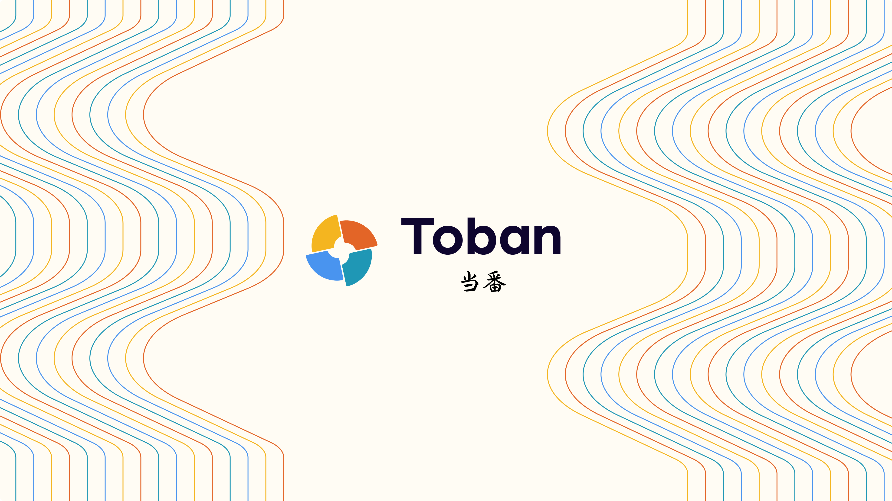

# toban

[](https://github.com/hackdays-io/toban/actions/workflows/test-contract.yml)

[](https://github.com/hackdays-io/toban/actions/workflows/deploy-document.yml)



## About This Project

Toban is a simplest way to record contribution and distribute rewards.

Projects that involve a diverse people, such as open source development, collaborative works by multiple creators, and volunteer activities, and in which the people involved change one after another, can be very exciting, but they also have their own unique difficulties.

For example

- Annoying to Track Works:
  - It's very tedious to report what you've accomplished for each task
  - Nobody are running a community to measure contributions by weighting each task.
  - We always forget anyway lol
- Rewards are required for Long term Contribution
  - There is no long-term contribution, just a volunteer spirit
  - There is no money to give out of the blue, and no one starts because of money.
  - Someone needs to do the housework and chores
- Ladder for Onboarding to the Community
  - Few people can participate on their own
  - It is difficult to understand the community enough to actually be able to do something
  - It's important to have a starting point that makes it easy to contribute something

Therefore, we created Role Based Rewards Distribution system to track contributions and distribute rewards by role.

Core features are

1. Manage responsibilities and rights on rolls
2. Track little contributions with P2P token transfer
3. Determine the rewards rate based on roll and engaged period
4. Distribute rewards quickly to a large number of people

These solutions were combined with ideas from [Hats Protocol](https://www.hatsprotocol.xyz/), [Splits](https://splits.org), and [Protocol Guild](https://protocol-guild.readthedocs.io/en/latest/).

## Document

[GitHub Pages Toban](https://hackdays-io.github.io/toban/)

## Slide

[Canva - Toban](https://www.canva.com/design/DAGOcvbwfFk/yKhJwHvZ9sC69AFEb0vnRg/view?utm_content=DAGOcvbwfFk&utm_campaign=designshare&utm_medium=link&utm_source=editor)

## Demo Video

[here - Youtube](https://www.youtube.com/watch?v=jFjxNSHiCBI)

## Related Contract Addresses

### Sepolia

| ContractAddress                            | Name                    | Memo |
| ------------------------------------------ | ----------------------- | ---- |
| 0x5d7a64Cc808294C516076d371685ed4E6aDd6337 | BigBang                 |      |
| 0xb8f7ca7a5b1e457b8735884419e114f90d53e1d5 | FractionToken           |      |
| 0x8da1c0864962c5e26c99cf839b0dc48e39104568 | SplitsCreatorFactory    |      |
| 0xda9fbab4436e4124cd6ee6864d4b46d0dd412414 | SplitsCreatorIMPL       |      |
| 0xd4a66507ea8c8382fa8474ed6cae4163676a434a | HatsTimeFrameModuleIMPL |      |
| 0x3bc1A0Ad72417f2d411118085256fC53CBdDd137 | Hats                    |      |
| 0x0a3f85fa597B6a967271286aA0724811acDF5CD9 | HatsModuleFactory       |      |
| 0x80f1B766817D04870f115fEBbcCADF8DBF75E017 | PullSplitsFactory       |      |

### Holesky

| ContractAddress                            | Name                 | Memo |
| ------------------------------------------ | -------------------- | ---- |
| 0xa55410b75578c8941a76249c18c72167459253c7 | BigBang              |      |
| 0x143a4605b682ec096274cef9fde5b3c077498942 | FractionToken        |      |
| 0xea4ee24c8411a71a7ce2cd676e1f17ebe18c2a98 | SplitsCreatorFactory |      |
| 0x3bc1A0Ad72417f2d411118085256fC53CBdDd137 | Hats                 |      |
| 0xfE661c01891172046feE16D3a57c3Cf456729efA | HatsModuleFactory    |      |
| 0x80f1B766817D04870f115fEBbcCADF8DBF75E017 | PullSplitsFactory    |      |

## How to work

- ### **setUp**

  - #### **frontend**

    You must set some ENVs

    1. create `pkgs/frontend/.env.local`

    2. set below values

       ```txt
        VITE_CHAIN_ID=11155111

        VITE_PRIVY_APP_ID=

        VITE_BIGBANG_ADDRESS=0x5d7a64Cc808294C516076d371685ed4E6aDd6337

        VITE_HATS_ADDRESS=0x3bc1A0Ad72417f2d411118085256fC53CBdDd137

        VITE_FRACTION_TOKEN_ADDRESS=0xb8f7ca7a5b1e457b8735884419e114f90d53e1d5

        VITE_PIMLICO_API_KEY=
       ```

  - #### **smartconract**

    You must set some ENVs

    1. create `pkgs/contact/.env`

    2. set below values

       ```txt
        PRIVATE_KEY=""
        ETHERSCAN_API_KEY=""
        ALCHEMY_API_KEY=""
        GAS_REPORT=
        COINMARKETCAP_API_KEY=""
        HATS_ADDRESS=""
        HATS_MODULE_FACTORY_ADDRESS=""
        PULL_SPLITS_FACTORY_ADDRESS=""
       ```

  - #### **install**

    ```bash
    yarn
    ```

- ### whitepaper(Docusaurus)

  - #### build

    ```bash
    yarn document build
    ```

  - #### start

    ```bash
    yarn document start
    ```

- ### frontend

  - #### **build frontend**

    ```bash
    yarn frontend build
    ```

  - #### **start frontend**

    ```bash
    yarn frontend dev
    ```

- ### contract

  - #### **compile**

    ```bash
    yarn contract compile
    ```

  - #### **test**

    ```bash
    yarn contract test
    ```

  - #### **coverage**

    ```bash
    yarn contract coverage
    ```

  - #### **clean**

    ```bash
    yarn contract clean
    ```

  - #### **get Balance of address**

    ```bash
    yarn contract getBalance --network sepolia
    ```

  - #### **get chaininfo**

    ```bash
    yarn contract getChainInfo --network sepolia
    ```

  - #### **deploy Sample Contract**

    ```bash
    yarn contract deploy:Lock --network sepolia
    ```

  - #### **verify deployed contract**

    ```bash
    yarn contract deploy:Lock --verify --network sepolia
    ```

  - #### **deploy all contract**

    ```bash
    yarn contract deploy:all --network sepolia
    ```

  - #### **upgrade BigBang contract**

    ```bash
    yarn contract upgrade:BigBang --network sepolia
    ```

  - #### **upgrade FractionToken Contract**

    ```bash
    yarn contract upgrade:FractionToken --network sepolia
    ```

  - #### **get deployed contract address**

    ```bash
    yarn contract getContractAddress --contract Lock --network sepolia
    ```

  - #### **resiger new subdomain to `toban.eth`**

    ```bash
    yarn contract registerSubdomain --label <your label> --network sepolia
    ```

  - #### **call bigbang task**

    Please set params when you execute.

    ```bash
    yarn contract bigbang --owner 0x51908F598A5e0d8F1A3bAbFa6DF76F9704daD072 --tophatdetails "tophatDetails" --tophatimageuri "tophatURI" --hatterhatdetails "hatterhatURI" --hatterhatimageuri "tophatDetails" --forwarder 0x51908F598A5e0d8F1A3bAbFa6DF76F9704daD072 --network sepolia
    ```

  - #### **call getWoreTime task**

    ```bash
    yarn contract getWoreTime --wearer 0x51908F598A5e0d8F1A3bAbFa6DF76F9704daD072 --network sepolia
    ```

  - #### **call mintHat task**

    ```bash
    yarn contract mintHat --hatid 17011726346972053710434886519909386955065038130623101235576378067255296 --wearer 0x1295BDc0C102EB105dC0198fdC193588fe66A1e4 --network sepolia
    ```
