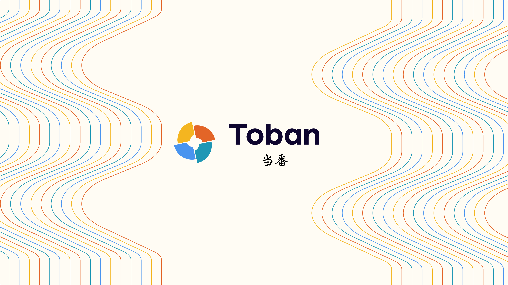

# toban

[](https://github.com/hackdays-io/toban/actions/workflows/test-contract.yml)

[](https://github.com/hackdays-io/toban/actions/workflows/build-frontend.yml)

[](https://github.com/hackdays-io/toban/actions/workflows/deploy-document.yml)



## About This Project

Toban is a simplest way to record contribution and distribute rewards.

Projects that involve a diverse people, such as open source development, collaborative works by multiple creators, and volunteer activities, and in which the people involved change one after another, can be very exciting, but they also have their own unique difficulties.

For example

- Annoying to Track Works:
  - It's very tedious to report what you've accomplished for each task
  - Nobody are running a community to measure contributions by weighting each task.
  - We always forget anyway lol
- Rewards are required for Long term Contribution
  - There is no long-term contribution, just a volunteer spirit
  - There is no money to give out of the blue, and no one starts because of money.
  - Someone needs to do the housework and chores
- Ladder for Onboarding to the Community
  - Few people can participate on their own
  - It is difficult to understand the community enough to actually be able to do something
  - It's important to have a starting point that makes it easy to contribute something

Therefore, we created Role Based Rewards Distribution system to track contributions and distribute rewards by role.

Core features are

1. Manage responsibilities and rights on roles
2. Track little contributions with P2P token transfer
3. Send Thanks Token(*)
4. Determine the rewards rate based on role and engaged period, and Fraction Token
5. Distribute rewards quickly to a large number of people

(*) In the implementation, what we refer to as a "Thanks Token" may also be called a "Fraction Token." In the application interface, it might appear as "Assist Credit" or "Role Share," depending on the version. However, all of these terms refer to the same concept.

These solutions were combined with ideas from [Hats Protocol](https://www.hatsprotocol.xyz/), [Splits](https://splits.org), and [Protocol Guild](https://protocol-guild.readthedocs.io/en/latest/).


## Live

[https://toban.xyz](https://toban.xyz/)

## Document

[GitHub Pages Toban](https://hackdays-io.github.io/toban/)

## Slide

[Canva - Toban](https://www.canva.com/design/DAGOcvbwfFk/yKhJwHvZ9sC69AFEb0vnRg/view?utm_content=DAGOcvbwfFk&utm_campaign=designshare&utm_medium=link&utm_source=editor)

## Demo Video

[here - Youtube](https://www.youtube.com/watch?v=jFjxNSHiCBI)

## Related Contract Addresses

> **一次情報は `pkgs/contract/outputs/contracts-<net>.json`** です（デプロイスクリプトが自動更新）。
> 下表は参考用のスナップショットで、デプロイのたびに古くなります。
> デプロイ手順は **[DEPLOYMENT.md](./DEPLOYMENT.md)** を参照。

### Sepolia

| ContractAddress | Name | Memo |
| --- | --- | --- |
| 0x010329e42cAc221D799C105516830D84901Dc2Ac | BigBang | **Toban のエントリポイント** |
| 0x84988CD2DdaC2137C9DF6b679341F0F180D9aaf2 | HatsQuestModule |  |
| 0x7fa6c0F8e4412ED72Ded8d591ABF58B276A992C9 | HatsTimeFrameModule |  |
| 0x830B6E01bf0d90941c756Ce3d9A24bC6FDCFbAb1 | SplitsCreatorFactory |  |
| 0x3a961240Ae4c01b15170940D2EDfAceCa996f2D8 | SplitsCreator |  |
| 0xa52E399Bc54f7CeB9d74784dC5D6289B7d970d1C | ThanksTokenFactory |  |
| 0x9eE2641Ba7017C63161C5682F077ab95E6C3eC0D | ScheduledDistributorFactory |  |
| 0xd6031f9543bEB0963e32CA2AC474de69D0515059 | FractionToken |  |
| 0x3bc1A0Ad72417f2d411118085256fC53CBdDd137 | Hats | 外部プロトコル（全チェーン共通） |
| 0x0a3f85fa597B6a967271286aA0724811acDF5CD9 | HatsModuleFactory | 外部プロトコル（全チェーン共通） |
| 0x80f1B766817D04870f115fEBbcCADF8DBF75E017 | PullSplitsFactory | 外部プロトコル（全チェーン共通） |

### Base

| ContractAddress | Name | Memo |
| --- | --- | --- |
| 0xda7BFDb08e09Bb3ba0bC8e37c5c322328E458003 | BigBang | **Toban のエントリポイント** |
| 0x7fa6c0F8e4412ED72Ded8d591ABF58B276A992C9 | HatsTimeFrameModule |  |
| 0x01e7fb1De0919c9743C5a93806CB957214D0d4cC | SplitsCreatorFactory |  |
| 0xbEDa908672b45ce6dd6a5a9461d5e83f03F27C9F | SplitsCreator |  |
| 0xa183E2C368B2BdDf14cE1C29Dfd23cFE2F7c1280 | ThanksTokenFactory |  |
| 0x90b04bCfa471d9642e12667a5a07094A8f165AdE | ScheduledDistributorFactory |  |
| 0x3bc1A0Ad72417f2d411118085256fC53CBdDd137 | Hats | 外部プロトコル（全チェーン共通） |
| 0x0a3f85fa597B6a967271286aA0724811acDF5CD9 | HatsModuleFactory | 外部プロトコル（全チェーン共通） |
| 0x80f1B766817D04870f115fEBbcCADF8DBF75E017 | PullSplitsFactory | 外部プロトコル（全チェーン共通） |

## Deploy

コントラクト / インデクサー / フロントエンド / Cloudflare Workers / Turnkey / Discord は
一列に依存しており、順序を間違えると壊れます。**必ず
[DEPLOYMENT.md](./DEPLOYMENT.md)** の手順に従ってください。

```
contract → sync:abis → subgraph → frontend(codegen)
                    ↘ Turnkey policy
   Cloudflare: identity Worker → discord-bot Worker → Discord
```

- 全レイヤーの手順書: **[DEPLOYMENT.md](./DEPLOYMENT.md)**
- つまづきポイント集: [deploy-base-production.md](./pkgs/extensions/discord-bot/docs/deploy-base-production.md)

## How to work

- ### **setUp**

  - #### **frontend**

    `pkgs/frontend/.env`（Sepolia）を `.env.example` からコピーして値を埋めます。
    Base で動かす場合は `.env.base`（`pnpm frontend dev:base` が読みます）。

    ```bash
    cp pkgs/frontend/.env.example pkgs/frontend/.env
    ```

    **コントラクトアドレスは上の [Related Contract Addresses](#related-contract-addresses)
    ではなく、`pkgs/contract/outputs/contracts-<net>.json` を一次情報として埋めてください。**
    変数の一覧と役割は [`pkgs/frontend/README.md`](./pkgs/frontend/README.md#環境変数) にあります。

  - #### **smartcontract**

    `pkgs/contract/.env` を `.env.example` からコピーして値を埋めます。
    **テストネットと本番で鍵が別**である点に注意してください。

    ```bash
    cp pkgs/contract/.env.example pkgs/contract/.env
    ```

    ```txt
     PRIVATE_KEY=""             # Sepolia / Holesky
     PRODUCTION_PRIVATE_KEY=""  # Base（本番・別鍵）
     ALCHEMY_API_KEY=""
     ETHERSCAN_API_KEY=""       # Sepolia / Holesky
     BASESCAN_API_KEY=""        # Base
     COINMARKETCAP_API_KEY=""
     GAS_REPORT=
     HATS_ADDRESS=""
     HATS_MODULE_FACTORY_ADDRESS=""
     PULL_SPLITS_FACTORY_ADDRESS=""
    ```

  - #### **install**

    ```bash
    pnpm install
    ```

- ### whitepaper(Docusaurus)

  - #### build

    ```bash
    pnpm document build
    ```

  - #### start

    ```bash
    pnpm document start
    ```

- ### subgraph

  - #### **goldsky login**

    ```bash
    goldsky login
    ```

  - #### **deploy subgraph to sepolia**

    ```bash
    pnpm subgraph prepare:sepolia
    pnpm subgraph codegen
    pnpm subgraph build
    pnpm subgraph deploy:sepolia
    ```

- ### frontend

  - #### **build frontend**

    ```bash
    pnpm frontend build
    ```

  - #### **start frontend**

    ```bash
    pnpm frontend dev
    ```

- ### contract

  - #### **compile**

    ```bash
    pnpm contract compile
    ```

  - #### **test**

    ```bash
    pnpm contract test
    ```

  - #### **coverage**

    ```bash
    pnpm contract coverage
    ```

  - #### **clean**

    ```bash
    pnpm contract clean
    ```

  - #### **get Balance of address**

    ```bash
    pnpm contract getBalance --network sepolia
    ```

  - #### **get chaininfo**

    ```bash
    pnpm contract getChainInfo --network sepolia
    ```

  - #### **deploy all contract**

    ```bash
    pnpm contract deploy:all --network sepolia
    ```

  - #### **upgrade BigBang contract**

    ```bash
    pnpm contract upgrade:BigBang --network sepolia
    ```

  - #### **upgrade FractionToken Contract**

    ```bash
    pnpm contract upgrade:FractionToken --network sepolia
    ```

  - #### **get deployed contract address**

    ```bash
    pnpm contract getContractAddress --contract BigBang --network sepolia
    ```

  - #### **resiger new subdomain to `toban.eth`**

    ```bash
    pnpm contract registerSubdomain --label <your label> --network sepolia
    ```

  - #### **call bigbang task**

    ワークスペースを作成する際に実行されるメソッド.
    必要なコントラクトが一式デプロイされる

    ```bash
    pnpm contract bigbang \
    --owner 0x51908F598A5e0d8F1A3bAbFa6DF76F9704daD072 \
    --tophatdetails "Dev Top Hat" \
    --tophatimageuri "dev-tophat" \
    --hatterhatdetails "Dev Hatter Hat" \
    --hatterhatimageuri "dev-hatterhat" \
    --memberhatdetails "Dev Member Hat" \
    --memberhatimageuri "dev-memberhat" \
    --network sepolia
    ```

  - #### **call getWoreTime task**

    ```bash
    pnpm contract getWoreTime --wearer 0x51908F598A5e0d8F1A3bAbFa6DF76F9704daD072 --network sepolia
    ```

  - #### **call mintHat task**

    ```bash
    # --module には bigBangコントラクトの時に出力される hatsTimeFrameModule のアドレスを当てはめること！
    pnpm contract mintHat --hatid 39145842972085145413893403125858635166881967613628980006401871953526784 --wearer 0xEef377Bdf67A227a744e386231fB3f264C158CDF --module 0xA193a4CE929168A594744A53Fb17Ba4caBb507a4 --network sepolia
    ```

  - #### **call batchMintHats task**

    ```bash
    # --module には bigBangコントラクトの時に出力される hatsTimeFrameModule のアドレスを当てはめること！
    pnpm contract batchMintHat --hatid 39145842972085145413893403125858635166881967613628980006401871953526784 --csv ./data/example-wearers.csv --module 0xA193a4CE929168A594744A53Fb17Ba4caBb507a4 --network sepolia
    ```

## Development with Claude Code (worktree)

`.claude/settings.json` に `WorktreeCreate` / `WorktreeRemove` フックを登録済みです。`claude --worktree <name>` 一発で issue ごとに独立した作業環境を立ち上げ、PR 作成まで進められます。

### Quick reference

| 操作 | コマンド |
| --- | --- |
| worktree を作成して Claude セッション起動 | `claude --worktree issue/xxx` |
| worktree 一覧 | `git worktree list` |
| PR 作成 (リモート main 向け) | `gh pr create --base main` |
| セッション終了 (フックで worktree も削除) | Claude セッション内で `/exit` |

### 1. worktree を作成して Claude を起動

別ペイン（tmux/VS Code split など）で実行:

```bash
claude --worktree issue/xxx
```

`WorktreeCreate` フックが `scripts/claude-worktree-create.sh` を起動し、以下を実行します:

1. `.claude/worktrees/issue/xxx/` に worktree を作成 (ブランチ名: `worktree-issue/xxx`)
2. `pkgs/{contract,frontend}/.env` を main repo からコピー
3. `pnpm install --frozen-lockfile`
4. `pnpm contract compile` (hardhat compile)

frontend で生成された GraphQL 型 (`pkgs/frontend/gql/`) はリポジトリにコミット済みなので、codegen は worktree 作成時に走らせません。スキーマ更新が必要なときだけ手動で `pnpm frontend codegen` を実行してください。

bootstrap ログは `.claude/worktrees/issue/xxx/.worktree-setup.log` に出力されます。

デフォルトでは現在の `HEAD` から分岐します。リモート `main` のクリーンな状態から始めたい場合:

```bash
TOBAN_WORKTREE_BASE_REF=origin/main claude --worktree issue/xxx
```

### 2. 編集 → コミット

worktree 内で通常どおり開発します。Claude セッションは worktree の中で起動しているので、Claude に依頼してそのまま編集 / コミットさせて構いません。手動の場合:

```bash
cd .claude/worktrees/issue/xxx
git add -A
git commit -m "feat: ..."
```

メインリポジトリと同じ lefthook の pre-commit (biome + frontend typecheck) が走ります。

### 3. リモート main 向け PR を作成

```bash
# Claude セッション内、または worktree ディレクトリで
git push -u origin worktree-issue/xxx
gh pr create --base main --title "<PR title>" --body "Closes #xxx"
```

Claude に「PR を作って」と頼めば push と `gh pr create` まで自動化されます。

### 4. worktree を終了・削除

Claude セッション内で `/exit` すると `WorktreeRemove` フック (`scripts/claude-worktree-remove.sh`) が発火し、worktree とローカルブランチが自動で削除されます。

セッション外から手動で片付ける場合:

```bash
git worktree remove .claude/worktrees/issue/xxx
git branch -D worktree-issue/xxx
git push origin --delete worktree-issue/xxx  # リモート追跡ブランチも消す場合
```

### Tips

- **並行作業**: `claude --worktree issue/aaa` と `claude --worktree issue/bbb` を別ペインで同時起動。各 worktree は独立した `node_modules` と `.env` を持つので衝突しません。
- **bootstrap 失敗は非ブロッキング**: `pnpm install` や `pnpm contract compile` が落ちても worktree 自体は作成完了。`.worktree-setup.log` を確認してください。
- **gitignore 済み**: `.claude/worktrees/` と `.claude/settings.local.json` はリポジトリ管理外。`.claude/settings.json` (チーム共有のフック設定) と `scripts/claude-worktree-*.sh` のみコミット対象です。
