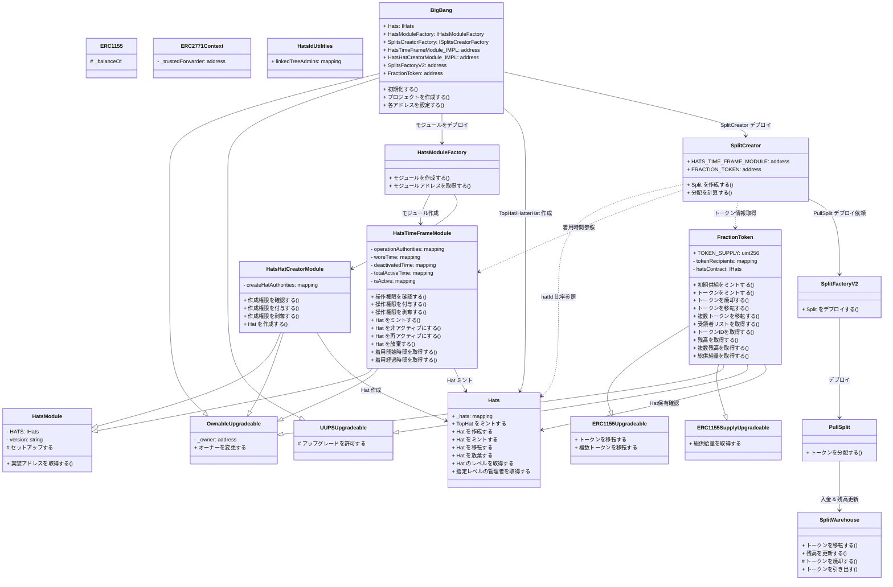

```mermaid
classDiagram

%% ========== Abstract Contracts ==========
class ERC1155 {
  # _balanceOf
}
class ERC2771Context {
  - _trustedForwarder: address
}
class ERC1155Upgradeable {
  + トークンを移転する
  + 複数トークンを移転する
}
class ERC1155SupplyUpgradeable {
  + 総供給量を取得する
}
class OwnableUpgradeable {
  - _owner: address
  + オーナーを変更する
}
class UUPSUpgradeable {
  # アップグレードを許可する
}

%% ========== Core Contracts and Modules ==========
class HatsIdUtilities {
  + linkedTreeAdmins: mapping
}

class Hats {
  + _hats: mapping
  + TopHat をミントする
  + Hat を作成する
  + Hat をミントする
  + Hat を移転する
  + Hat を放棄する
  + Hat のレベルを取得する
  + 指定レベルの管理者を取得する
}

class BigBang {
  + Hats: IHats
  + HatsModuleFactory: IHatsModuleFactory
  + SplitsCreatorFactory: ISplitsCreatorFactory
  + HatsTimeFrameModule_IMPL: address
  + HatsHatCreatorModule_IMPL: address
  + SplitsFactoryV2: address
  + FractionToken: address
  + 初期化する()
  + プロジェクトを作成する()
  + 各アドレスを設定する()
}

class HatsModuleFactory {
  + モジュールを作成する()
  + モジュールアドレスを取得する()
}

class HatsModule {
  - HATS: IHats
  - version: string
  + 実装アドレスを取得する()
  # セットアップする
}

class HatsTimeFrameModule {
  - operationAuthorities: mapping
  - woreTime: mapping
  - deactivatedTime: mapping
  - totalActiveTime: mapping
  - isActive: mapping
  + 操作権限を確認する()
  + 操作権限を付与する()
  + 操作権限を剥奪する()
  + Hat をミントする()
  + Hat を非アクティブにする()
  + Hat を再アクティブにする()
  + Hat を放棄する()
  + 着用開始時間を取得する()
  + 着用経過時間を取得する()
}

class HatsHatCreatorModule {
  - createHatAuthorities: mapping
  + 作成権限を確認する()
  + 作成権限を付与する()
  + 作成権限を剥奪する()
  + Hat を作成する()
}

class FractionToken {
  + TOKEN_SUPPLY: uint256
  - tokenRecipients: mapping
  - hatsContract: IHats
  + 初期供給をミントする()
  + トークンをミントする()
  + トークンを焼却する()
  + トークンを移転する()
  + 複数トークンを移転する()
  + 受領者リストを取得する()
  + トークンIDを取得する()
  + 残高を取得する()
  + 複数残高を取得する()
  + 総供給量を取得する()
}

class SplitWarehouse {
  + トークンを移転する()
  + 残高を更新する()
  # トークンを焼却する()
  + トークンを引き出す()
}

class SplitCreator {
  + HATS_TIME_FRAME_MODULE: address
  + FRACTION_TOKEN: address
  + Split を作成する()
  + 分配を計算する()
}

class SplitFactoryV2 {
  + Split をデプロイする()
}

class PullSplit {
  + トークンを分配する()
}

%% ========== Structs (as comments) ==========
%% Hat struct: eligibility, maxSupply, supply, lastHatId, toggle, config, details, imageURI
%% SplitsInfo struct: hatId, multiplierBottom, multiplierTop, wearers

%% ========== Inheritance ==========
BigBang --|> OwnableUpgradeable
BigBang --|> UUPSUpgradeable
HatsTimeFrameModule --|> HatsModule
HatsTimeFrameModule --|> OwnableUpgradeable
HatsHatCreatorModule --|> HatsModule
HatsHatCreatorModule --|> OwnableUpgradeable
FractionToken --|> ERC1155Upgradeable
FractionToken --|> ERC1155SupplyUpgradeable
FractionToken --|> OwnableUpgradeable
FractionToken --|> UUPSUpgradeable

%% ========== Relationships / Dependencies ==========
HatsModuleFactory --> HatsTimeFrameModule : モジュール作成
HatsModuleFactory --> HatsHatCreatorModule : モジュール作成
HatsTimeFrameModule --> Hats : Hat ミント
HatsHatCreatorModule --> Hats : Hat 作成
BigBang --> HatsModuleFactory : モジュールをデプロイ
BigBang --> Hats : TopHat/HatterHat 作成
BigBang --> SplitCreator : SplitCreator デプロイ
SplitCreator ..> Hats : hatId 比率参照
SplitCreator ..> HatsTimeFrameModule : 着用時間参照
SplitCreator ..> FractionToken : トークン情報取得
SplitCreator --> SplitFactoryV2 : PullSplit デプロイ依頼
SplitFactoryV2 --> PullSplit : デプロイ
PullSplit --> SplitWarehouse : 入金 & 残高更新
FractionToken --> Hats : Hat保有確認

```
