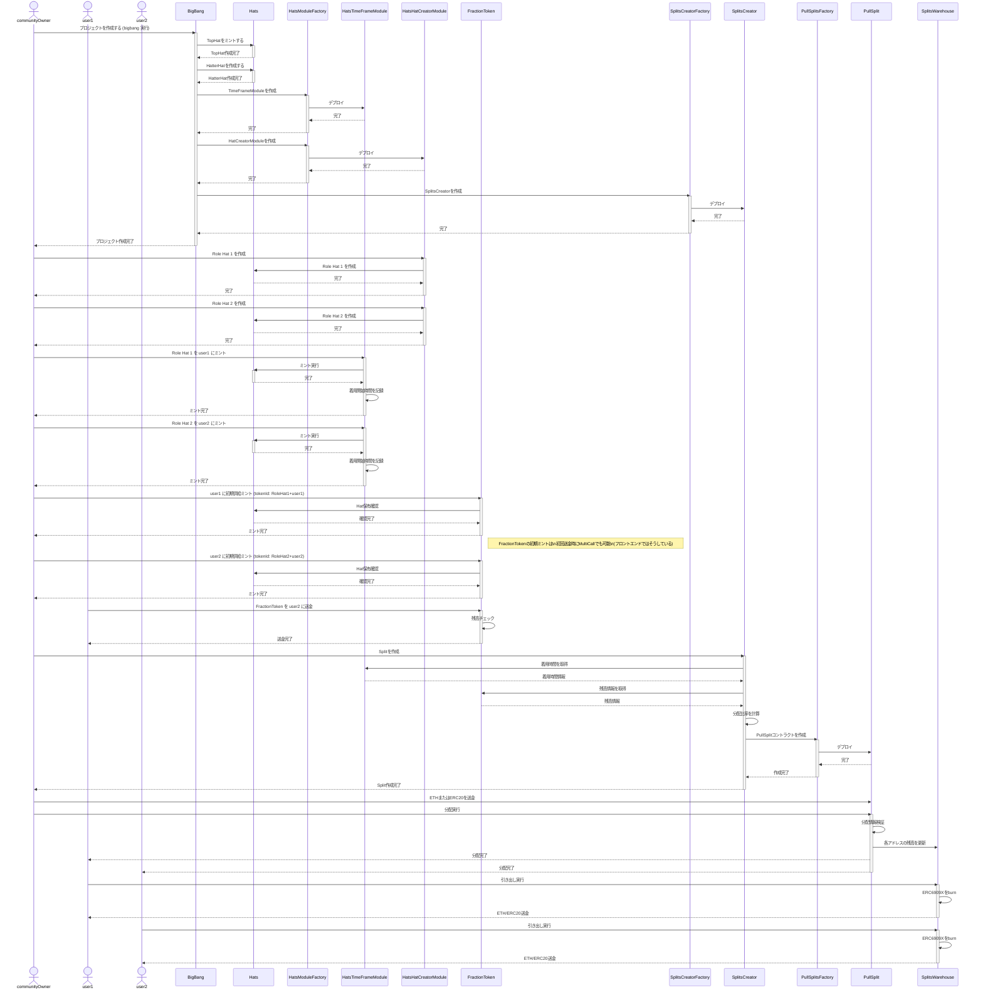

```mermaid
sequenceDiagram
    actor communityOwner
    actor user1
    actor user2
    participant BigBang
    participant Hats
    participant HatsModuleFactory
    participant HatsTimeFrameModule
    participant HatsHatCreatorModule
    participant FractionToken
    participant SplitsCreatorFactory
    participant SplitsCreator
    participant PullSplitsFactory
    participant PullSplit
    participant SplitsWarehouse

    %% プロジェクト初期化フェーズ
    communityOwner ->> BigBang: プロジェクトを作成する (bigbang 実行)
    activate BigBang

    BigBang ->> Hats: TopHatをミントする
    activate Hats
    Hats -->> BigBang: TopHat作成完了
    deactivate Hats

    BigBang ->> Hats: HatterHatを作成する
    activate Hats
    Hats -->> BigBang: HatterHat作成完了
    deactivate Hats

    BigBang ->> HatsModuleFactory: TimeFrameModuleを作成
    activate HatsModuleFactory
    HatsModuleFactory ->> HatsTimeFrameModule: デプロイ
    HatsTimeFrameModule -->> HatsModuleFactory: 完了
    HatsModuleFactory -->> BigBang: 完了
    deactivate HatsModuleFactory

    BigBang ->> HatsModuleFactory: HatCreatorModuleを作成
    activate HatsModuleFactory
    HatsModuleFactory ->> HatsHatCreatorModule: デプロイ
    HatsHatCreatorModule -->> HatsModuleFactory: 完了
    HatsModuleFactory -->> BigBang: 完了
    deactivate HatsModuleFactory

    BigBang ->> SplitsCreatorFactory: SplitsCreatorを作成
    activate SplitsCreatorFactory
    SplitsCreatorFactory ->> SplitsCreator: デプロイ
    SplitsCreator -->> SplitsCreatorFactory: 完了
    SplitsCreatorFactory -->> BigBang: 完了
    deactivate SplitsCreatorFactory

    BigBang -->> communityOwner: プロジェクト作成完了
    deactivate BigBang

    %% Role Hat作成フェーズ
    communityOwner ->> HatsHatCreatorModule: Role Hat 1 を作成
    activate HatsHatCreatorModule
    HatsHatCreatorModule ->> Hats: Role Hat 1 を作成
    Hats -->> HatsHatCreatorModule: 完了
    HatsHatCreatorModule -->> communityOwner: 完了
    deactivate HatsHatCreatorModule

    communityOwner ->> HatsHatCreatorModule: Role Hat 2 を作成
    activate HatsHatCreatorModule
    HatsHatCreatorModule ->> Hats: Role Hat 2 を作成
    Hats -->> HatsHatCreatorModule: 完了
    HatsHatCreatorModule -->> communityOwner: 完了
    deactivate HatsHatCreatorModule

    %% Hat着用フェーズ
    communityOwner ->> HatsTimeFrameModule: Role Hat 1 を user1 にミント
    activate HatsTimeFrameModule
    HatsTimeFrameModule ->> Hats: ミント実行
    activate Hats
    Hats -->> HatsTimeFrameModule: 完了
    deactivate Hats
    HatsTimeFrameModule ->> HatsTimeFrameModule: 着用開始時間を記録
    HatsTimeFrameModule -->> communityOwner: ミント完了
    deactivate HatsTimeFrameModule

    communityOwner ->> HatsTimeFrameModule: Role Hat 2 を user2 にミント
    activate HatsTimeFrameModule
    HatsTimeFrameModule ->> Hats: ミント実行
    activate Hats
    Hats -->> HatsTimeFrameModule: 完了
    deactivate Hats
    HatsTimeFrameModule ->> HatsTimeFrameModule: 着用開始時間を記録
    HatsTimeFrameModule -->> communityOwner: ミント完了
    deactivate HatsTimeFrameModule

    %% FractionTokenの初期ミントフェーズ
    communityOwner ->> FractionToken: user1 に初期供給ミント (tokenId: RoleHat1+user1)
    activate FractionToken
    FractionToken ->> Hats: Hat保有確認
    Hats -->> FractionToken: 確認完了
    FractionToken -->> communityOwner: ミント完了
    deactivate FractionToken

    note right of FractionToken: FractionTokenの初期ミントは\n初回送金時にMultiCallでも可能\n(フロントエンドではそうしている)

    communityOwner ->> FractionToken: user2 に初期供給ミント (tokenId: RoleHat2+user2)

    activate FractionToken
    FractionToken ->> Hats: Hat保有確認
    Hats -->> FractionToken: 確認完了
    FractionToken -->> communityOwner: ミント完了
    deactivate FractionToken

    %% トークン移転フェーズ
    user1 ->> FractionToken: FractionToken を user2 に送金
    activate FractionToken
    FractionToken ->> FractionToken: 残高チェック
    FractionToken -->> user1: 送金完了
    deactivate FractionToken

    %% Split作成・分配フェーズ
    communityOwner ->> SplitsCreator: Splitを作成
    activate SplitsCreator
    SplitsCreator ->> HatsTimeFrameModule: 着用時間を取得
    HatsTimeFrameModule -->> SplitsCreator: 着用時間情報

    SplitsCreator ->> FractionToken: 残高情報を取得
    FractionToken -->> SplitsCreator: 残高情報

    SplitsCreator ->> SplitsCreator: 分配比率を計算

    SplitsCreator ->> PullSplitsFactory: PullSplitコントラクトを作成
    activate PullSplitsFactory
    PullSplitsFactory ->> PullSplit: デプロイ
    PullSplit -->> PullSplitsFactory: 完了
    PullSplitsFactory -->> SplitsCreator: 作成完了
    deactivate PullSplitsFactory

    SplitsCreator -->> communityOwner: Split作成完了
    deactivate SplitsCreator

    %% 分配実行フェーズ
    communityOwner ->> PullSplit: ETHまたはERC20を送金
    communityOwner ->> PullSplit: 分配実行
    activate PullSplit
    PullSplit ->> PullSplit: 分配情報検証
    PullSplit ->> SplitsWarehouse: 各アドレスの残高を更新
    PullSplit -->> user1: 分配完了
    PullSplit -->> user2: 分配完了
    deactivate PullSplit

    %% 引き出しフェーズ
    user1 ->> SplitsWarehouse: 引き出し実行
    activate SplitsWarehouse
    SplitsWarehouse ->> SplitsWarehouse: ERC6909Xをburn
    SplitsWarehouse -->> user1: ETH/ERC20送金
    deactivate SplitsWarehouse

    user2 ->> SplitsWarehouse: 引き出し実行
    activate SplitsWarehouse
    SplitsWarehouse ->> SplitsWarehouse: ERC6909Xをburn
    SplitsWarehouse -->> user2: ETH/ERC20送金
    deactivate SplitsWarehouse
```
